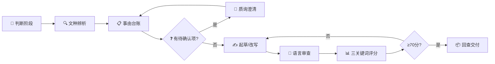

<div align="center">

# 公文函写作技能

**理解目的 · 锁定要素 · 控制语气 · 一函一事**

面向 Codex / Claude Code 的党政机关公文函写作 AI Agent Skill

[核心能力](#核心能力) · [14种函类型](#14-种函类型) · [工作流程](#工作流程) · [安装使用](#安装与使用) · [目录结构](#目录结构)

</div>

---

## 这不是什么

> [!IMPORTANT]
> 这不是"一键生成公文"工具。它不会 blindly 生成一篇像函的文章，而是先理解行政目的，
> 锁定事由要素，控制语气分寸，确保一函一事，在用户确认后才输出函件。

| 一键生成工具 | 本技能 |
|:---:|:---:|
| 凭主题猜内容 | 先建事由台账，锁定硬约束 |
| 不区分函类型 | 14 种函各有结构和结语规范 |
| 语气随机 | 平行文语气规则 + 禁用措辞表 |
| 可能编造事实 | 零编造 + 〔待补〕标注 |
| 黑盒输出 | 三关键词量化评分 + 审查清单 |

## 核心能力

- **14 种函类型** — 商洽/询问/请批/告知/征求意见/邀请/催办/协调/协办/答复/批准/提案答复/建议答复/转办
- **文种辨析** — 函 vs 请示/通知/报告/批复，核心看隶属关系
- **三关键词质控** — 站位/逻辑/内容，5 维度 100 分量表
- **AI 痕迹检测** — 清理套话、空话、公式化表达
- **零编造** — 不添加用户未提供的事实和数据
- **格式联动** — 起草完成后可调用 `$document-format-skill` 做格式终审
- **SuperGrill 质询引擎** — 乔哈里视窗驱动，动手前用最少轮次锁定最有影响的决策边界；区域诊断→理解锁定→结构化多选→增量验证→硬关卡退出，不猜、不烦、不留暗箱

## 五条底线

1. **一函一事** — 不夹带不相关事项
2. **零编造** — 不添加用户未提供的事实
3. **平行文语气** — 不命令、不卑微
4. **结语规范** — 按类型自动匹配
5. **复函必引据** — 必须引用来函标题和字号

## 14 种函类型

| # | 类型 | 方向 | 结语示例 |
|---|---|---|---|
| 1 | 商洽函 | 去函 | 请予支持/盼复 |
| 2 | 询问函 | 去函 | 请函复/盼复 |
| 3 | 请批函 | 去函 | 请予审批/妥否请函复 |
| 4 | 告知函 | 去函 | 特此函告 |
| 5 | 征求意见函 | 去函 | 请于X日前反馈 |
| 6 | 邀请函 | 去函 | 敬请莅临 |
| 7 | 催办函 | 去函 | 请抓紧办理 |
| 8 | 协调函 | 去函 | 请按分工落实 |
| 9 | 协办/协助函 | 去函 | 请予协助为盼 |
| 10 | 一般答复函 | 复函 | 特此函复 |
| 11 | 批准函 | 复函 | 特此函复 |
| 12 | 提案答复函 | 复函 | 感谢关心和支持 |
| 13 | 建议答复函 | 复函 | 感谢关心和支持 |
| 14 | 转办函 | 去函 | 请办理后函告结果 |

## 工作流程



## 安装与使用

### 1. 克隆到技能目录

```bash
# Codex
git clone https://github.com/Bugu1012/official-letter-skill.git ~/.codex/skills/official-letter-skill

# Claude Code
git clone https://github.com/Bugu1012/official-letter-skill.git ~/.claude/skills/official-letter-skill
```

### 2. 触发

在对话中输入 `$official-letter-skill` 或说"帮我写个函""审查这份函件"。

### 3. 格式终审

起草完成后，调用 `$document-format-skill` 做格式终审。

## 目录结构

```
公文函写作.skill/
├── SKILL.md                    # 主技能文件（6KB）
├── README.md                   # 本文件
├── 技能说明.md                  # 维护者说明
├── .gitignore
├── agents/openai.yaml
├── references/                 # 17 个规则文件
│   ├── 资料导航.md
│   ├── 规范依据.md
│   ├── 函的分类与适用.md
│   ├── 文种辨析.md
│   ├── 正文结构.md
│   ├── 撰写思路.md
│   ├── 句式库.md
│   ├── 语气与措辞.md
│   ├── 信函式格式.md
│   ├── 常见错误图谱.md
│   ├── AI写函方法论.md
│   ├── 三关键词量化评估.md
│   ├── 机关制度适配.md
│   ├── 开源技能参考借鉴.md
│   ├── 样例索引使用说明.md
│   ├── 个人助手方法论适配.md
│   └── 函语言自然化.md
├── assets/                     # 9 个模板文件
│   ├── 函起草模板.md
│   ├── 函审查清单.md
│   ├── 函改写提示卡.md
│   ├── 文种辨析速查表.md
│   ├── 结语速查表.md
│   ├── 内部类型结构模板.md
│   ├── 征求意见函模板.md
│   ├── 征求意见函采集指南.md
│   └── 真实公开样例索引.csv    # 760 条
├── 征求意见函/                  # 真实样例全文（8 篇函 + 1 公告 + 1 范文）
│   ├── MEE_建设项目环评分类管理名录征求意见函_2026.txt
│   ├── MEE_固定污染源排污许可名录征求意见函_2026.txt
│   ├── NHC_食养指南征求意见函_2026.txt
│   ├── NHC_医院洁净手术部规范征求意见函_2024.txt
│   ├── NHC_传染病医院设计规范征求意见函_2024.txt
│   ├── 食标秘_2025年度标准立项计划征求意见函_食标秘发2025-1号.txt
│   ├── 食标秘_2026年度标准立项计划征求意见函_食标秘发2026-5号.txt
│   └── 食标秘_食品营养强化剂标准征求意见函_食标秘发2023-4号.txt
└── design.md                   # 设计文档（不公开）
```

## 重要边界

- 不做内容事实核验
- 不接触涉密内容
- 不替代审核签发
- 不做便函
- 不做批量生成

## 致谢与参考

本技能在开发过程中参考了以下开源项目和方法论：

**同类技能**
- [zhaohui-yang/official-document-drafting](https://github.com/zhaohui-yang/official-document-drafting) — 函 spec：起笔定式、谋篇原则、语域控制、要素分层
- [Liuxiangjian-ai/official-document-skill](https://github.com/Liuxiangjian-ai/official-document-skill) — 文种表、行文关系、表达模式
- [KaguraNanaga/official-document-writing-skill](https://github.com/KaguraNanaga/official-document-writing-skill) — 函模板、结语用语表、质量检查清单

**格式与工程参考**
- [wzbwan/gongwen-format-skill](https://github.com/wzbwan/gongwen-format-skill) — 受控 Markdown 协议设计
- [pamelaaaaa1218/gongwen-format-skill](https://github.com/pamelaaaaa1218/gongwen-format-skill) — 国企公文格式实践

**同系列技能**
- [Bugu1012/document-format-skill](https://github.com/Bugu1012/document-format-skill) — 公文格式修订技能（本技能格式终审联动对象）
- [Bugu1012/Meeting-minutes](https://github.com/Bugu1012/Meeting-minutes) — 会议纪要技能（方法论参照：五轮审查、事由台账、humanizer 语言自然化）
- [Bugu1012/Meeting-minutes-writing-handbook](https://github.com/Bugu1012/Meeting-minutes-writing-handbook) — 会议纪要人工写作手册（本手册姊妹篇）

详细借鉴分析见 `references/开源技能参考借鉴.md`。

**质询式澄清**
- SuperGrill — 乔哈里视窗（Johari Window）驱动的结构化质询式澄清协议。将信息盲区分为开放/隐藏/盲区/未知四区域，按区域动态选择策略；通过理解锁定硬关卡、每次一问的结构化多选、保守推荐优先、3 轮上限和注入免疫，确保在动手之前用最少轮次确认最有影响的决策边界，杜绝猜测式起草。

## 规范依据

- GB/T 9704-2012《党政机关公文格式》（[国家标准全文公开系统](https://openstd.samr.gov.cn/bzgk/gb/newGbInfo?hcno=F3CC9BEF482524C895FDA7A08BB4A70E)）
- 《党政机关公文处理工作条例》（中办发〔2012〕14号）

---

<div align="center">

**理解目的 · 锁定要素 · 控制语气 · 一函一事**

</div>

## License

MIT
